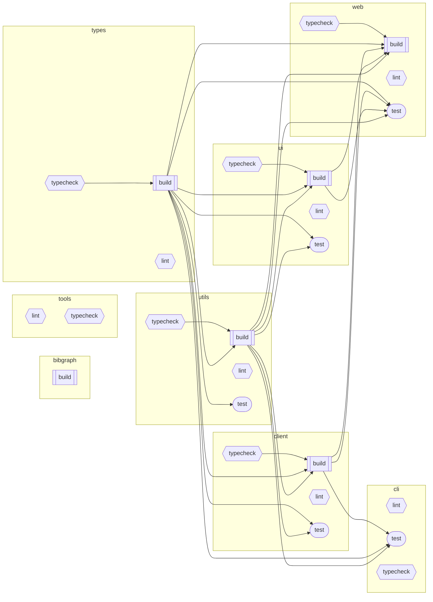

# BibGraph

> [@.specify/memory/constitution.md](.specify/memory/constitution.md)

Nx-managed pnpm monorepo for exploring academic literature via the [OpenAlex API](https://docs.openalex.org/). TypeScript React SPA + CLI tool with multi-tier caching, force-directed graphs, and storage abstraction.

**[Live Application](https://mearman.github.io/BibGraph/)** | **[Repository](https://github.com/Mearman/BibGraph)**

[](https://github.com/Mearman/BibGraph/actions/workflows/ci.yml)

## Quick Start

```bash
pnpm install              # Install dependencies
pnpm dev                  # Start web app (apps/web)
pnpm cli                  # Run CLI tool (apps/cli)
pnpm validate             # Full pipeline: typecheck + lint + test + build
```

## Commands Reference

### Development

```bash
pnpm dev                          # Start web development server
pnpm cli                          # OpenAlex CLI tool
pnpm cli stats                    # Cache statistics
pnpm cli search authors "ML"      # Search entities
pnpm cli get A5017898742          # Fetch specific entity
```

### Testing & Quality

```bash
pnpm test                         # Run all tests
pnpm test:web                     # Web app tests only
pnpm test:packages                # Package tests only
pnpm typecheck                    # TypeScript validation
pnpm lint                         # ESLint checking
pnpm validate                     # Full pipeline: typecheck + lint + test + build
```

### Build & Nx Operations

```bash
pnpm build                        # Build all projects (Nx orchestration)
nx graph                          # View dependency graph
nx affected:test                  # Test only changed projects
nx affected:build                 # Build only changed projects
nx reset                          # Reset Nx cache (use when cache issues occur)
```

### Cleanup & Maintenance

```bash
pnpm clean                        # Remove dist, coverage, .nx/cache
pnpm kill-nx                      # Kill stuck Nx daemon processes
pnpm kill-nx:emergency            # Force kill all Nx processes and clean temp files
```

### Barrel Management (Barrelsby Integration)

```bash
pnpm barrels                      # Generate barrel files via Nx across all projects
pnpm barrels:dry                  # Preview barrel changes without applying
```

### E2E Tests

```bash
pnpm nx e2e web                     # Smoke suite (default)
E2E_FULL_SUITE=true pnpm nx e2e web # Full suite
pnpm nx e2e web --grep="@entity"    # Filter by tag
pnpm nx e2e web --list              # List tests
```

### Accessibility & Performance

```bash
pnpm test:accessibility             # Run pa11y accessibility tests (WCAG 2.1 AA)
pnpm test:accessibility:dev         # Run a11y tests against dev server
pnpm test:performance               # Run Lighthouse CI performance tests
nx run web:test:accessibility       # Direct Nx task for accessibility
nx run web:test:performance         # Direct Nx task for performance
nx run web:a11y                     # Low-level pa11y task
nx run web:lighthouse               # Low-level Lighthouse task
```

## Monorepo Structure

```
apps/
  web/          # React SPA (TanStack Router + Mantine UI + Vanilla Extract)
  cli/          # Command-line tool for OpenAlex data management
packages/
  client/       # OpenAlex API client (rate limiting + caching + interceptors)
  ui/           # Mantine-based UI components (atoms/molecules/organisms)
  utils/        # Storage providers + logger + type guards
  types/        # Shared TypeScript types + Zod schemas (canonical source)
  algorithms/   # Graph algorithms (clustering, community detection)
specs/          # Implementation plans (SpecKit workflow)
config/         # Shared configuration
scripts/        # Build and utility scripts
tools/          # Development tools
```

### Task Dependency Graph

<!-- nx-task-graph-start -->

<!-- nx-task-graph-end -->

## Architecture

- **Storage**: IndexedDB via Dexie with `CatalogueStorageProvider` interface
- **Caching**: Memory → localStorage → IndexedDB → Static JSON → OpenAlex API
- **Routing**: Entity-centric (`/authors/A123`, `/works/W123`, `/doi/...`)
- **State**: TanStack React Query + Dexie stores

## OpenAlex API

Entity prefixes: **W** Works, **A** Authors, **S** Sources, **I** Institutions, **P** Publishers, **F** Funders, **T** Topics, **C** Concepts, **K** Keywords, **D** Domains, **SF** Subfields

URL patterns: `/authors/A123`, `/works/W123`, `/doi/10.1038/...`, `/$bareId` (auto-detect)

## Development Guidelines

See [Project Constitution](.specify/memory/constitution.md) for development principles.

## Testing

Run with `pnpm test` or `pnpm validate` for full pipeline.

## CI/CD

GitHub Actions: validate → e2e → deploy → post-deploy verification → semantic-release. See `.github/workflows/ci.yml`.

## Key Features

- **Xpac Works**: 190M additional research outputs (datasets, software, specimens)
- **Entity Relationships**: Filterable, direction-aware relationship visualization
- **Graph Algorithms**: 9 clustering algorithms, traversal, pathfinding (see `packages/algorithms/`)
- **Multi-tier Caching**: 80-99% bandwidth savings via field-level caching

## Technology Stack

**Core**: TypeScript, React 19, TanStack Router, Mantine UI, Vanilla Extract, Nx, pnpm

**Storage**: IndexedDB (Dexie), localStorage

**Testing**: Vitest, Playwright, axe-core, MSW

**Visualization**: D3 force simulation, custom graph algorithms

## Research Context

Part of PhD research on **cultural heritage data preservation and citizen science engagement** at Bangor University, Wales.

**Research Focus**: Bridging computational methods with cultural heritage accessibility through crowdsourced data repositories and ML/CV techniques.

## User Stories

### Personas

1. **Researcher** - Academic conducting literature reviews and discovery
2. **PhD Student** - Primary user (Joe), doing systematic review and thesis work
3. **Analyst** - Exploring citation networks and academic relationships

### Literature Discovery

**US-01: Multi-entity search**
As a researcher, I want to search for works, authors, sources, and institutions so I can discover relevant literature across 250M+ scholarly records.
- Acceptance:
  - Search input accepts free-text queries
  - Results return from OpenAlex API with entity type indicated
  - Results paginate with configurable page size
  - Empty queries or zero-result searches display appropriate feedback
  - Search respects rate limiting and retries with exponential backoff

**US-02: Search result view modes**
As a researcher, I want to toggle between list, card, and table views of search results so I can choose the format best suited to scanning or comparing entries.
- Acceptance:
  - Three view modes available: list, card, table
  - View mode persists across navigation within the session
  - All entity metadata visible in each mode (title, authors, year, citations at minimum)
  - Switching modes preserves current result set and scroll position

**US-03: Advanced query builder**
As a researcher, I want to use advanced query operators (AND/OR/NOT) so I can construct precise searches that narrow results to my topic.
- Acceptance:
  - Query builder supports boolean operators
  - Operator precedence is visually clear
  - Invalid queries produce user-friendly error messages
  - Queries can be saved and replayed (see US-22)

**US-04: Entity type filtering**
As a researcher, I want to filter search results by entity type so I can focus on works, authors, or sources independently.
- Acceptance:
  - Multi-select checkboxes for each entity type
  - Filtering updates results without full page reload
  - Filter state reflected in URL for shareability
  - Result count per type displayed before filtering

**US-05: External identifier lookup**
As a researcher, I want to look up entities by external identifiers (DOI, ORCID, ISSN, ROR) so I can jump directly to a known entity without searching.
- Acceptance:
  - Routes resolve: `/works/doi/$doi`, `/authors/orcid/$orcid`, `/sources/issn/$issn`, `/institutions/ror/$ror`
  - Invalid identifiers display clear error with format guidance
  - Successful lookup redirects to the canonical entity page
  - Pasted OpenAlex URLs also resolve (via `/openalex-url/$` route)

### Entity Exploration

**US-06: Entity detail pages**
As a researcher, I want to view detailed profiles for any entity (work, author, source, institution, funder, publisher) so I can assess relevance and context.
- Acceptance:
  - All 12 entity types have dedicated detail pages
  - Key metadata rendered: name/title, identifiers, counts, dates
  - Rich view and raw JSON view available
  - Loading and error states handled gracefully
  - Page URL is shareable and bookmarkable

**US-07: Bidirectional relationships**
As a researcher, I want to see bidirectional relationships (incoming and outgoing) for any entity so I can understand how it connects to the broader academic network.
- Acceptance:
  - Outgoing relationships shown with solid line indicators
  - Incoming relationships shown with dashed line indicators
  - Relationship counts displayed as badges
  - Clicking a related entity navigates to its detail page

**US-08: Relationship filtering**
As a researcher, I want to filter relationships by type and direction so I can focus on specific connections (e.g., only co-authors, only citing works).
- Acceptance:
  - Multi-select filter for relationship types
  - Direction toggle (incoming, outgoing, both)
  - Filter state updates the visible relationship list without page reload
  - Count summaries update to reflect active filters

**US-09: Collaboration networks**
As a researcher, I want to explore an author's collaboration network so I can identify research groups and potential collaborators.
- Acceptance:
  - Author detail page shows co-author list with collaboration counts
  - Clicking a co-author navigates to their profile
  - Option to visualise collaboration network in graph view (links to US-10)

### Graph Visualisation

**US-10: Force-directed graph**
As an analyst, I want to visualise entities as a force-directed graph so I can see structural patterns in citation and collaboration networks.
- Acceptance:
  - Graph renders nodes and edges from bookmarks, history, or cache data
  - Nodes labelled with entity name; edges indicate relationship type
  - Graph is pannable and zoomable
  - Force simulation runs in Web Worker (per Principle V)
  - Handles 1000+ nodes without freezing the UI

**US-11: 2D/3D graph modes**
As an analyst, I want to switch between 2D and 3D graph modes so I can use the layout best suited to my analysis.
- Acceptance:
  - Toggle between 2D (canvas) and 3D (WebGL) rendering
  - 3D mode supports keyboard controls for rotation and zoom
  - Graceful fallback from WebGL to canvas if GPU unavailable
  - Layout state (positions, zoom) preserved when switching modes

**US-12: Node expansion**
As an analyst, I want to click a node to expand its neighbours so I can progressively explore the network around entities of interest.
- Acceptance:
  - Single-click or context menu triggers neighbour expansion
  - New nodes animate into position
  - Expansion depth is configurable
  - Already-expanded nodes are visually distinguished
  - Expansion fetches from cache first, then API

**US-13: Community detection**
As an analyst, I want to run community detection algorithms (Louvain, spectral, label propagation) so I can identify clusters in the network.
- Acceptance:
  - Algorithm selection from dropdown or panel
  - Detected communities colour-coded on the graph
  - Community membership count displayed per cluster
  - Results persist until cleared or re-run

**US-14: Pathfinding**
As an analyst, I want to find paths between two entities using pathfinding algorithms so I can trace connections across the citation graph.
- Acceptance:
  - Select source and target nodes (click or search)
  - Path highlighted on graph with distinct edge styling
  - Path length and intermediate nodes listed
  - Supports Dijkstra and bidirectional BFS

**US-15: Motif detection**
As an analyst, I want to detect network motifs (triangles, star patterns, co-citations, bibliographic coupling) so I can identify structural patterns.
- Acceptance:
  - Motif type selectable from menu
  - Detected motifs highlighted on graph
  - Count of each motif type reported
  - Motif nodes/edges visually distinguishable from non-motif elements

**US-16: Graph comparison**
As an analyst, I want to compare two graphs side-by-side so I can evaluate different expansion strategies or datasets.
- Acceptance:
  - `/graph-comparison` route renders two graph panels
  - Each panel independently configurable (data source, layout, algorithm)
  - Shared entities highlighted across panels
  - Panels can be synchronised or independent for pan/zoom

### Collection Management

**US-17: Bookmarking**
As a researcher, I want to bookmark entities so I can build a curated reading list over time.
- Acceptance:
  - Bookmark toggle available on entity detail pages and search results
  - Bookmarks persisted in IndexedDB via `CatalogueStorageProvider`
  - Bookmark count displayed in navigation
  - `/bookmarks` page lists all bookmarked entities

**US-18: Tagging**
As a researcher, I want to organise bookmarks with tags so I can group literature by theme or review section.
- Acceptance:
  - Tags can be created, renamed, and deleted
  - Multiple tags assignable per bookmark
  - Filter bookmarks by tag
  - Tags persisted alongside bookmark data

**US-19: Catalogue lists**
As a researcher, I want to create named catalogue lists so I can maintain separate collections for different projects or review stages.
- Acceptance:
  - Create, rename, and delete named lists
  - Add/remove entities from lists
  - Lists visible in `/catalogue` route
  - Special lists (`__history__`, `__bookmarks__`) are system-managed and not deletable

**US-20: Export**
As a researcher, I want to export collections as BibTeX, RIS, JSON, or CSV so I can import them into reference managers or analysis tools.
- Acceptance:
  - Export format selectable from dropdown
  - Export operates on current view (bookmarks, catalogue list, or search results)
  - BibTeX and RIS outputs valid for import into Zotero/Mendeley
  - Large exports (>1000 items) do not block the UI

**US-21: Sharing**
As a researcher, I want to share catalogue lists via URL so I can collaborate with supervisors or co-authors.
- Acceptance:
  - Share button generates a shareable URL for a catalogue list
  - Shared URL renders read-only view without requiring authentication
  - Shared list displays entity metadata identically to the owner's view

### History & Navigation

**US-22: Visit history**
As a user, I want to automatic visit history tracking so I can return to previously viewed entities without re-searching.
- Acceptance:
  - Each entity page visit recorded with timestamp
  - `/history` page lists visited entities in reverse chronological order
  - History persisted in IndexedDB (`__history__` special list)
  - History can be cleared by the user

**US-23: Search history**
As a user, I want to save and replay previous searches so I don't have to reconstruct queries I've used before.
- Acceptance:
  - Recent searches displayed on search page or autocomplete
  - Clicking a saved search re-executes it with original parameters
  - Search history is clearable

**US-24: OpenAlex URL handling**
As a user, I want to paste OpenAlex URLs directly into the app so I can transition from the API documentation or other tools seamlessly.
- Acceptance:
  - Routes: `/openalex-url/$`, `/api-openalex-org/$`, `/https/$`, `/openalex.org/$`
  - Valid URLs resolve to the correct entity detail page
  - Invalid URLs display helpful error with link format examples

### Caching & Performance

**US-25: Multi-tier caching**
As a user, I want the app to cache API responses across memory, localStorage, IndexedDB, and static JSON so that previously viewed entities load instantly.
- Acceptance:
  - Cache hierarchy: Memory > localStorage > IndexedDB > Static JSON > API
  - Cache hits avoid network requests entirely
  - Cache achieves 80-99% bandwidth savings on repeated access
  - Stale cache entries are refreshed in background

**US-26: Cache management**
As a user, I want to browse and manage my cache so I can see what's stored locally and clear space if needed.
- Acceptance:
  - `/cache` route displays cached entities with previews
  - Storage usage statistics shown (size, entry count, last modified)
  - Clear cache by entity type or entirely
  - Cache rebuild option available

### Research Evaluation (PhD-specific)

**US-27: Dataset upload**
As a PhD student, I want to upload systematic review datasets so I can evaluate my algorithms against established benchmarks.
- Acceptance:
  - `/evaluation/datasets` accepts file upload
  - Supported formats documented on the page
  - Upload validation with error feedback for malformed files
  - Uploaded datasets listed and selectable for evaluation runs

**US-28: Evaluation results**
As a PhD student, I want to view evaluation metrics and results so I can assess algorithm performance for my thesis.
- Acceptance:
  - `/evaluation/results` displays metrics from completed evaluation runs
  - Metrics include those defined in STAR methodology
  - Results exportable for inclusion in thesis

**US-29: Xpac data toggle**
As a PhD student, I want to toggle Xpac data (190M additional works) so I can test against an expanded dataset when needed.
- Acceptance:
  - Toggle available in `/settings`
  - Toggling updates search and entity resolution to include/exclude Xpac works
  - Xpac works visually distinguished (badge indicating dataset/software/specimen)
  - Toggle state persisted across sessions

### CLI

**US-30: CLI entity search**
As a developer, I want to search and fetch entities from the command line so I can script data retrieval for batch processing.
- Acceptance:
  - `pnpm cli search <entity-type> <term>` returns matching entities
  - `pnpm cli get <entity-id>` fetches a specific entity
  - Output formats: JSON, table
  - Rate limiting respected

**US-31: CLI cache management**
As a developer, I want to view cache statistics and manage cached data via CLI so I can maintain the local data store without opening the browser.
- Acceptance:
  - `pnpm cli stats` shows per-entity-type cache counts and sizes
  - `pnpm cli cache clear` removes all cached data
  - `pnpm cli cache rebuild` re-fetches and re-indexes cached entities

## Active Technologies

- TypeScript 5.9.2 (ES modules, strict mode) (038-graph-list)
- IndexedDB via Dexie (existing `CatalogueStorageProvider` interface, add `graph` special list) (038-graph-list)

## Recent Changes

- 038-graph-list: Added TypeScript 5.9.2 (ES modules, strict mode)
