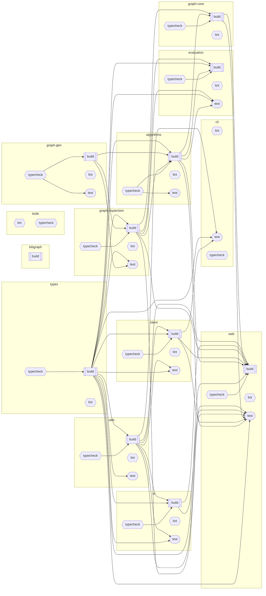

# BibGraph

Nx-managed pnpm monorepo for exploring academic literature via the [OpenAlex API](https://docs.openalex.org/). TypeScript React SPA + CLI tool with multi-tier caching, force-directed graphs, and storage abstraction.

**[Live Application](https://mearman.github.io/BibGraph/)** | **[Repository](https://github.com/Mearman/BibGraph)**

[](https://github.com/Mearman/BibGraph/actions/workflows/ci.yml)

## Quick Start

```bash
pnpm install              # Install dependencies
pnpm dev                  # Start web app (apps/web)
pnpm cli                  # Run CLI tool (apps/cli)
pnpm validate             # Full pipeline: typecheck + lint + test + build
```

## Commands Reference

### Development

```bash
pnpm dev                          # Start web development server
pnpm cli                          # OpenAlex CLI tool
pnpm cli stats                    # Cache statistics
pnpm cli search authors "ML"      # Search entities
pnpm cli get A5017898742          # Fetch specific entity
```

### Testing & Quality

```bash
pnpm test                         # Run all tests
pnpm test:web                     # Web app tests only
pnpm test:packages                # Package tests only
pnpm typecheck                    # TypeScript validation
pnpm lint                         # ESLint checking
pnpm validate                     # Full pipeline: typecheck + lint + test + build
```

### Build & Nx Operations

```bash
pnpm build                        # Build all projects (Nx orchestration)
nx graph                          # View dependency graph
nx affected:test                  # Test only changed projects
nx affected:build                 # Build only changed projects
nx reset                          # Reset Nx cache (use when cache issues occur)
```

### Cleanup & Maintenance

```bash
pnpm clean                        # Remove dist, coverage, .nx/cache
pnpm kill-nx                      # Kill stuck Nx daemon processes
pnpm kill-nx:emergency            # Force kill all Nx processes and clean temp files
```

### Barrel Management (Barrelsby Integration)

```bash
pnpm barrels                      # Generate barrel files via Nx across all projects
pnpm barrels:dry                  # Preview barrel changes without applying
```

### E2E Tests

```bash
pnpm nx e2e web                     # Smoke suite (default)
E2E_FULL_SUITE=true pnpm nx e2e web # Full suite
pnpm nx e2e web --grep="@entity"    # Filter by tag
pnpm nx e2e web --list              # List tests
```

### Accessibility & Performance

```bash
pnpm test:accessibility             # Run pa11y accessibility tests (WCAG 2.1 AA)
pnpm test:accessibility:dev         # Run a11y tests against dev server
pnpm test:performance               # Run Lighthouse CI performance tests
nx run web:test:accessibility       # Direct Nx task for accessibility
nx run web:test:performance         # Direct Nx task for performance
nx run web:a11y                     # Low-level pa11y task
nx run web:lighthouse               # Low-level Lighthouse task
```

## Monorepo Structure

```
apps/
  web/          # React SPA (TanStack Router + Mantine UI + Vanilla Extract)
  cli/          # Command-line tool for OpenAlex data management
packages/
  client/       # OpenAlex API client (rate limiting + caching + interceptors)
  ui/           # Mantine-based UI components (atoms/molecules/organisms)
  utils/        # Storage providers + logger + type guards
  types/        # Shared TypeScript types + Zod schemas (canonical source)
  algorithms/   # Graph algorithms (clustering, community detection)
specs/          # Implementation plans (SpecKit workflow)
config/         # Shared configuration
scripts/        # Build and utility scripts
tools/          # Development tools
```

### Task Dependency Graph

<!-- nx-task-graph-start -->

<!-- nx-task-graph-end -->

## Architecture

- **Storage**: IndexedDB via Dexie with `CatalogueStorageProvider` interface
- **Caching**: Memory → localStorage → IndexedDB → Static JSON → OpenAlex API
- **Routing**: Entity-centric (`/authors/A123`, `/works/W123`, `/doi/...`)
- **State**: TanStack React Query + Dexie stores

## OpenAlex API

Entity prefixes: **W** Works, **A** Authors, **S** Sources, **I** Institutions, **P** Publishers, **F** Funders, **T** Topics, **C** Concepts, **K** Keywords, **D** Domains, **SF** Subfields

URL patterns: `/authors/A123`, `/works/W123`, `/doi/10.1038/...`, `/$bareId` (auto-detect)

## Development Guidelines

See [Project Constitution](.specify/memory/constitution.md) for development principles.

## Testing

Run with `pnpm test` or `pnpm validate` for full pipeline.

## CI/CD

GitHub Actions: validate → e2e → deploy → post-deploy verification → semantic-release. See `.github/workflows/ci.yml`.

## Key Features

- **Xpac Works**: 190M additional research outputs (datasets, software, specimens)
- **Entity Relationships**: Filterable, direction-aware relationship visualization
- **Graph Algorithms**: 9 clustering algorithms, traversal, pathfinding (see `packages/algorithms/`)
- **Multi-tier Caching**: 80-99% bandwidth savings via field-level caching

## Technology Stack

**Core**: TypeScript, React 19, TanStack Router, Mantine UI, Vanilla Extract, Nx, pnpm

**Storage**: IndexedDB (Dexie), localStorage

**Testing**: Vitest, Playwright, axe-core, MSW

**Visualization**: D3 force simulation, custom graph algorithms

## Research Context

Part of PhD research on **cultural heritage data preservation and citizen science engagement** at Bangor University, Wales.

**Research Focus**: Bridging computational methods with cultural heritage accessibility through crowdsourced data repositories and ML/CV techniques.
